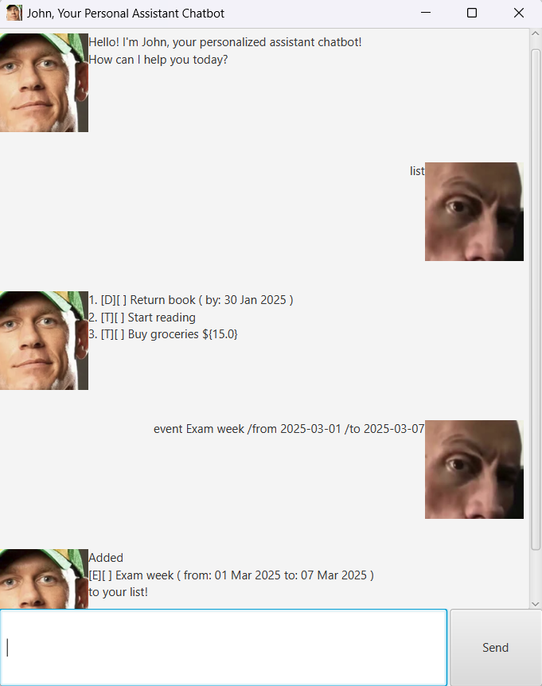

# John User Guide



Meet John, a lightweight chatbot that helps you manage your tasks easily 
and efficiently.

## Adding tasks

You can add 3 types of tasks to your task list which you can refer to later.

1. `todo`: This adds a basic task to your list

Example: `todo read books`

This will output
```
added
[T][ ] read books
to your list!
```

2. `deadline`: This adds a task with a deadline (YYYY-MM-DD) to your list

Example: `deadline return books /by 2025-03-01`

This will output
```
added
[D][ ] return books (by: 01 Mar 2025)
to your list!
```

3. `event`: This adds a task with a start and an end (in any format) to your list

Example: `event go to the library /from 2:00PM /to 4:00PM`

This will output
```
added
[E][ ] go to the library (from: 2:00PM to: 4:00PM)
to your list!
```

## Tracking expenses

When adding tasks, you can also input expenses related to those tasks by 
appending ${Y} at the end, where Y is the expense for that task

For example,

`todo buy groceries ${15}`

will save $15 as the expense for buying groceries.

You can type `expense` to see the total expense for your task list

This will output `your total expense from all the tasks are: $Y`

where Y is the sum of all expenses for all the tasks in your list.

## Seeing your tasks

To see your entire task list, use the `list` command.

This will show your entire task list, similar to what's shown below
```
1. [T][ ] read books
2. [D][ ] return books (by: 01 Mar 2025)
3. [E][ ] go to the library (from: 2:00PM to: 4:00PM)
```

## Modifying tasks
To mark a task as done or not done, use `mark X` or `unmark X`,
where X is the index of the task you want to mark.

For example, using `mark 2` on the list above will result in 

`marking "return books" as done!`

and your list will look like
```
1. [T][ ] read books
2. [D][X] return books (by: 01 Mar 2025)
3. [E][ ] go to the library (from: 2:00PM to: 4:00PM)
```

If you want to delete a task, use `delete X`, where X is the index of the task
you want to delete.

For example, using `delete 3` on the list above will result in 
```
removed
[E][ ] go to the library (from: 2:00PM to: 4:00PM)
from your list!
```
and your list will now look like
```
1. [T][ ] read books
2. [D][X] return books (by: 01 Mar 2025)
```

## Finding tasks
To find tasks containing specific words, you can use `find X`, where X is the word you're searching for.

For example, using `find read` on the list 
```
1. [T][ ] read books
2. [D][X] return books (by: 01 Mar 2025)
3. [E][ ] go to the library (from: 2:00PM to: 4:00PM)
```
will return 
```
1. [T][ ] read books
2. [D][X] return books (by: 01 Mar 2025)
```

## Closing the app
Type `bye' or click the close button on the GUI to close the app.

## Getting help
Type `help` to see all the available commands.